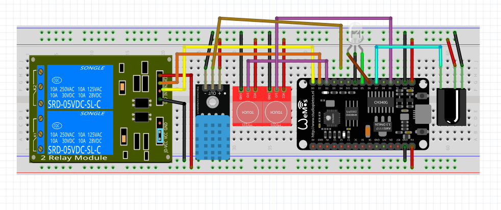

# ESP8266/ESP32 Smart Home Controller 🏡

A DIY smart home hub to control your lights and appliances from anywhere using TTP223 capacitive touch sensors, an IR remote,SinricPro mobile app, google home or the cloud! This project is built to be reliable, easy to set up, and modular.

## 📐 Circuit Diagram

---

## ✨ Key Features

* **Multiple Control Options:** Control two relays using TTP223 capacitive touch sensors, any IR remote, or the **SinricPro app** (which works with Alexa & Google Home).
* **Temperature & Humidity Monitoring:** Keep an eye on your room's climate with a **DHT11 sensor**, visible in the SinricPro app.
* **Easy WiFi Setup:** No need to hardcode WiFi passwords! A built-in web portal lets you connect the device to your network easily. It can even store a backup WiFi network.
* **Remembers Its State:** The relays remember if they were on or off, so they return to the correct state after a power outage.
* **Status LEDs:** Onboard LEDs give you a clear visual indication of the WiFi connection status.

---

## 🛠️ What You'll Need

### Hardware
* **Microcontroller:** ESP8266 or ESP32
* **Relay Module:** 2-Channel
* **Sensor:** DHT11 Temperature & Humidity Sensor
* **Input:** IR Receiver, TTP223 Capacitive Touch Sensors (x2)
* **Output:** LEDs for status indication
* **Button:** A physical push button for WiFi configuration

### Software
* **Arduino IDE**
* **Libraries:** `SinricPro`, `DHT`, `WiFiManager`, `IRremote`, `EEPROM`

---

## 🔌 Pinout

The pin connections are flexible and can be changed in the code. Here’s a suggested layout for an ESP8266:

This table shows the actual pin configuration used in the Smart Home Control System.  
Each pin is defined in the source code for clarity and easy modification.

| Function                     | ESP8266 Pin | GPIO No. |
| :---------------------------- | :---------- | :-------- |
| Relay 1                      | `D0`        | GPIO16   |
| Relay 2                      | `D1`        | GPIO5    |
| **Touch Sensor 1 (Switch 1)**| `D2`        | GPIO4    |
| **Touch Sensor 2 (Switch 2)**| `RX`        | GPIO3    |
| DHT11 Sensor                 | `D4`        | GPIO2    |
| WiFi Connected LED           | `D5`        | GPIO14   |
| WiFi Disconnected LED        | `D6`        | GPIO12   |
| IR Receiver                  | `D7`        | GPIO13   |
| WiFi Config Button           | `D3`        | GPIO0    |
---
> ⚙️ **Note:**  
> - `GPIO3 (RX)` is used as a digital input for Switch 2. It works fine if not used for serial communication.  
> - Avoid pulling `GPIO0`, `GPIO2`, or `GPIO15` low during boot, as they control the ESP8266’s startup mode.
## 🚀 How to Get Started

1. **Get SinricPro Keys:** Sign up for free at [SinricPro](https://sinric.pro/), create your devices, and note down the **`APP_KEY`**, **`APP_SECRET`**, and **`DEVICE_IDs`**.

2. **Edit the Code:** Open the code in the Arduino IDE and paste in your SinricPro keys.  

3. **Upload:** Connect your ESP board to your computer and upload the code.  

4. **Configure WiFi:**
    * Hold the **config button** (in this case that is flash button which is connected to GPIO0 or D3) for 10 seconds to start the WiFi portal.
    * On your phone or computer, connect to the WiFi network named **"SmartHomeConfig"**.  
      Use **`Aman@123`** as the portal password.
    * The configuration page will open automatically. In the **SSID** and **Password** fields, enter the WiFi credentials that are currently available and working (the library will try to connect to this immediately).  
    * Enter your primary WiFi SSID and password for the first network, and your secondary SSID and password for the second network. These credentials will be stored in EEPROM for automatic fallback, as WiFiManager does **not** save them in EEPROM.

5. **You're Done!** You can now control your relays from the app, your IR remote, or by tapping the touch sensors.

---

## 💡 LED Status Guide

* 🟢 **Green LED ON:** Connected to WiFi and ready to go.
* 🔴 **Red LED ON:** No WiFi connection.
* ✨ **Both LEDs ON:** WiFi setup mode is active.

---

## 🔮 Future Ideas

* Add Over-the-Air (OTA) firmware updates.
* Support more relays and sensors.
* Create a local web dashboard for control without the internet.

---

**Author:** Aman Prasad

---

## 📄 License

This project is licensed under the [MIT License](./LICENSE) – see the LICENSE file for details.
